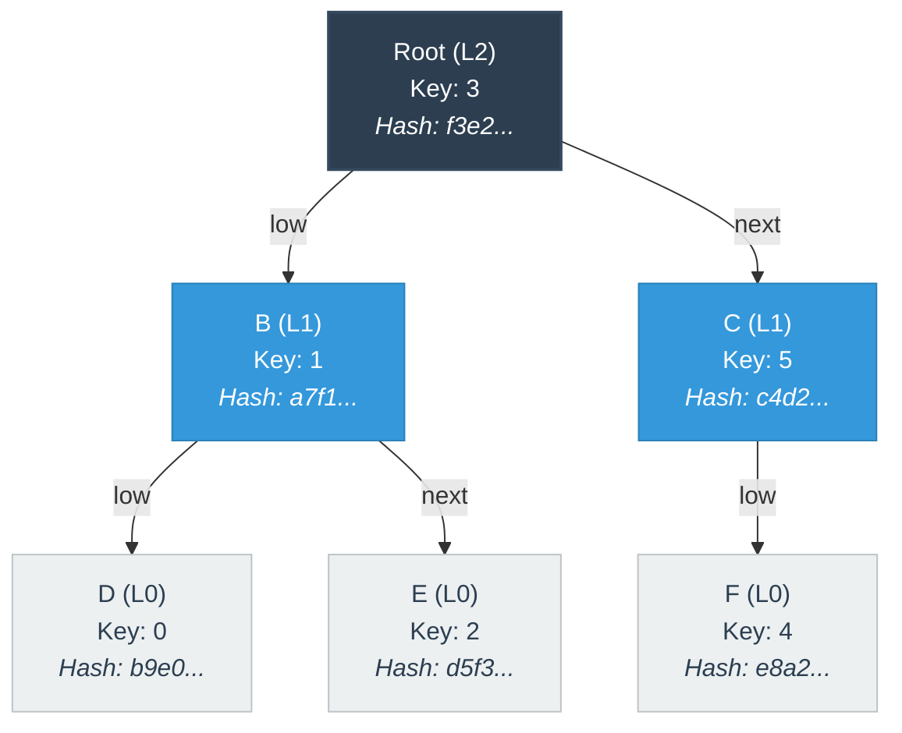

# MST - Merkle Search Tree

A Rust implementation of the Merkle Search Tree (MST) as described in ["Merkle Search Trees: Efficient State-Based CRDTs in Open Networks"](https://inria.hal.science/hal-02303490/document). I built this mostly as a learning exercise to wrap my head around how MSTs work and how they can be applied to distributed systems.

> **Note:** This isn't production-ready code! If you want the real deal that was used in the original paper's experiments, check out [the original repository](https://gitlab.inria.fr/aauvolat/mst_exp). I also found another Rust implementation [here](https://github.com/domodwyer/merkle-search-tree), which seems to be a much more mature implementation.

## The Structure of Merkle Search Trees

MSTs combine the verification aspects of Merkle trees with the ordered search capabilities of search trees. Unlike regular Merkle trees, MSTs keep track of key ordering, which makes them great for operations on sequential data (like timestamped events).

Here's what they look like:



The hash at each node depends on:
1. The node's key-value pair
2. The hashes of its children (both low and next pointers)
3. Where it sits in the tree's total ordering (level)

This structure gives us some nice properties:
- **Deterministic Structure**: Given a set of elements, there's exactly one valid way to arrange them
- **Verification**: Any data tampering breaks the hash chain
- **Probabilistic Balance**: The tree stays balanced without having to do explicit rebalancing
- **Efficient Reconciliation**: When two nodes have identical hashes, their entire subtrees must be identical too

## MSTs as State-Based CRDTs

Merkle Search Trees are really great for building Conflict-free Replicated Data Types (CRDTs) that get updated in a distributed environment using something like a gossip protocol.

This makes them useful for:
- Peer-to-peer datastores
- Blockchain state management
- Distributed databases with eventual consistency

## Core Operations

### Query Operations
```rust
// Find value associated with key
let value = tree.get_value(item_key);

// Convert tree to sorted list
let values = tree.to_list();
```

### Modification Operations
```rust
// Insert key-value pair
let new_root = tree.insert(item_key, item_value);
```

### Tree Manipulation
```rust
// Merge two trees, resolving conflicts deterministically
let (merged_root, merged_store) = tree1.merge(&tree2);
```

## Usage

```rust
use mst::{MST, MSTKey};
use mst::test_utils::TestValue;

// Create a new tree
let mut tree: MST<TestValue> = MST::new();

// Insert some values (using different key creation methods)
// Method 1: Using helper function
let key1 = create_key(&[0, 0, 0, 0]);
let value1 = TestValue { key: key1, data: [1, 0, 0, 0] };
tree.insert(key1, value1);

// Method 2: Using from_slice directly for byte strings
let key2 = MSTKey::from_slice(b"key2");
let value2 = TestValue { key: key2, data: [2, 0, 0, 0] };
tree.insert(key2, value2);

// Retrieve values
let retrieved_value = tree.get_value(key1);
assert_eq!(retrieved_value, Some(value1));

// Merge with another tree
let mut another_tree = MST::new();
let key3 = MSTKey::from_slice(&[3; 32]);
let value3 = TestValue { key: key3, data: [3, 0, 0, 0] };
another_tree.insert(key3, value3);

// Merge trees using the core MST properties
let (merged_root, merged_store) = tree.merge(&another_tree);

// Create a new tree from the merged result
let merged_tree = MST::with_store(merged_root, merged_store);
```

## Further Reading

If you want to dive deeper into MSTs and their applications:

- [Original paper: "Merkle Search Trees: Efficient State-Based CRDTs in Open Networks"](https://inria.hal.science/hal-02303490v1)
- [Reference implementation with p2p event store](https://gitlab.inria.fr/aauvolat/mst_exp)
